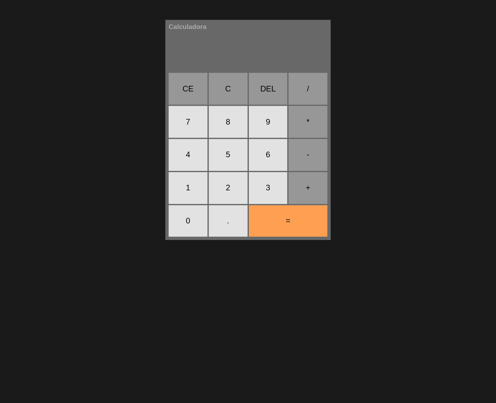

# Calculadora de operações básicas

Este é um projeto de uma calculadora com as principais operações matemáticas (+, -, *, /) e opções básicas de apagar o último número, apagar toda a operação, apagar o valor atual e mostrar o resultado. 

## Índice

- [Visão geral](#visão-geral)
  - [O desafio](#o-desafio)
  - [Captura de tela](#captura-de-tela)
  - [Links](#links)
- [Meu processo](#meu-processo)
  - [Tecnologias utilizadas](#tecnologias-utilizadas)
  - [O que aprendi](#o-que-aprendi)
  - [Status do projeto](#status-do-projeto)
  - [Recursos úteis](#recursos-úteis)
- [Autora](#autora)
- [Licença](#licença)

## Visão geral

### O desafio

Os usuários devem ser capazes de:

- Fazer cálculos matemáticos básicos ( + | - | * | / )
- Limpar a tela com as opções ( DEL | C | CE )
- Ver os estados de foco para todos os elementos interativos na página

### Captura de tela



### Links

- URL da solução: [GitHub](https://github.com/adynaslima/Projeto-Calculadora.git)
- URL do site: [Deploy](https://projeto-calculadora-seven.vercel.app/)

## Meu processo

### Tecnologias utilizadas

- Marcação HTML5 semântica
- Propriedades personalizadas CSS
- Flexbox
- Grid
- JavaScript

### O que aprendi

```js
    switch(operation) {
        case "+":
            operationValue = previous + current;
            this.updateScreen(operationValue, operation, current, previous)
            break;
        case "-":
            operationValue = previous - current;
            this.updateScreen(operationValue, operation, current, previous)
            break;
    //...
    }
```

### Status do projeto

Em construção...

### Recursos úteis

- [Vídeo - Hora de Codar](https://www.youtube.com/watch?v=KCfaPZ2t2yA&t=2536s) - Esse vídeo me ajudou a desenvolver a calculadora. Recomendo a todos que estão iniciando JavaScript e desejam fazer alguma aplicação mais básica. 

## Autora

- GitHub - [Adyna Lima](https://github.com/adynaslima)
- LinkedIn - [Adyna Lima](https://www.linkedin.com/in/adynalima/)

## Licença

Este projeto está licenciado nos termos da licença MIT.